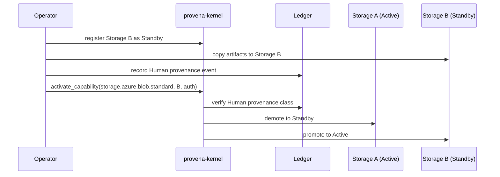

# Migration Model

Storage migrations are a first-class provenance event in Provena, not a routing operation.

## Why migrations are special

Moving data between storage roles (for example, from standard to archival) changes the provenance chain. That change must be recorded in the ledger with an explicit authorizing identity. It cannot happen automatically or silently.

## Human provenance class

All storage migrations carry the `Human` provenance class. Human-class events require named human authorization. The kernel will never initiate a migration - only respond to one that has been explicitly authorized.

This means:
- No automatic data tiering
- No silent rerouting when a storage backend becomes unavailable
- Every migration is a ledger entry with a named author

## Ledger entry

A migration ledger entry records:
- The source and destination capability names
- The artifact identifiers being migrated
- The authorizing identity
- The provenance class (`Human`)
- A timestamp

The ledger is append-only. The migration record cannot be altered after the fact - only followed by an addendum if a correction is required.
