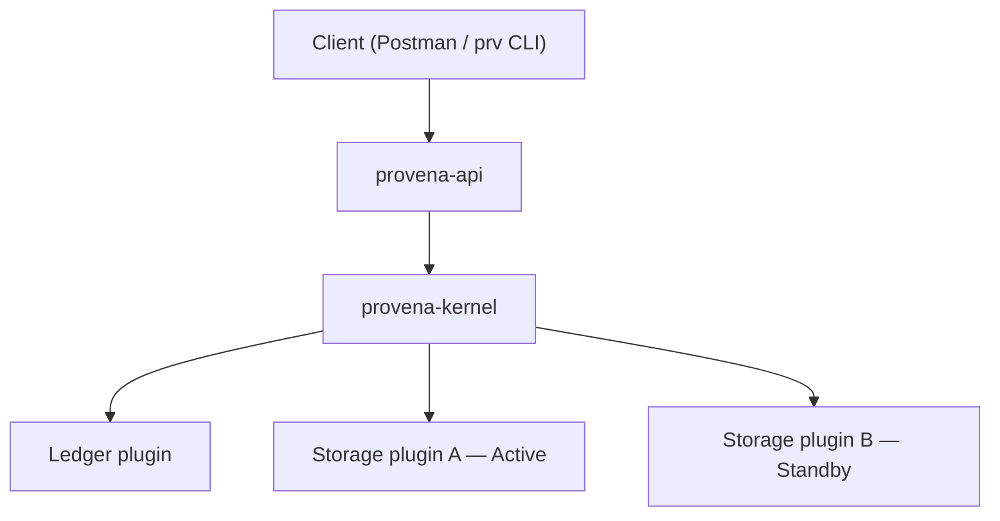

# Architecture Overview

Provena follows a hexagonal architecture with the kernel at the hub.

The kernel knows three things: what capabilities exist, which plugins are healthy, and where to route requests. No business logic ever lives in the kernel. Everything that does work — including core services like the ledger — is a plugin.

## Provenance classes

Every artifact and ledger entry carries a provenance class:

| Class | Meaning |
|---|---|
| `Deterministic` | Rule-based, reproducible — no human or AI involvement |
| `Machine` | LLM or ML generated — traceable but not reproducible |
| `Human` | Accountable gate — requires named human authorization |

Human-class events are hard stops. They are never triggered automatically.

## Ledger discipline

The ledger is append-only. Nothing is ever mutated or deleted. Corrections are addendums, not overwrites. The ledger is idempotent — replaying it produces the same state. Every entry references its provenance class and the authorizing identity.

## Authorization

The ledger is not just an audit trail — it is the live authorization state store. Whether an artifact can be used as a source for downstream derivation is determined by reading its ledger history, not a permissions table. See [Authorization Model](authorization-model.md) for the full design.
